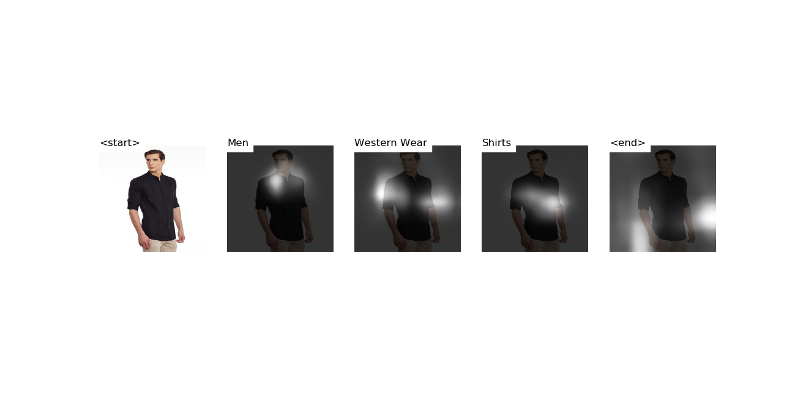

# Atlas

Source code of our paper "Constrained Beam Search Based Sequence model for product category classification" runnable on GPU and CPU. You can clone and run this project in your CPU/GPU to mimic the results reported in the paper.

## What does this project do?
* Performs automatic taxonomy prediction of Clothing images
* Provides a dataset of 183,996 clothing images from 52 categories along with image description and pre-defined taxonomy

## Getting started
### Setting up the project
* Clone this repository to your local machine

* Create a virtual environment named `atlas` and install all the project's dependencies
listed in `requirements.txt`


### Predicting using Product Categorization model
Follow these steps to predict the category path for a product using pur pretrained product categoristion model: 
1. Download the pre-trained model and the word map file from [Google Drive](https://drive.google.com/file/d/1MLbgQrACPvgxQTCP41FaNZr_gomTXkpu/view]).
2. Switch to `models/product_categorization` directory
3. From the command line, point to the image, model, word map (and optionally, the beam size) as follows:

```
python caption_cbs.py --img='../../dataset/atlas_test/sample_1.jpg' --model='path/to/BEST_checkpoint_coco_5_cap_per_img_5_min_word_freq.pth.tar' --word_map='path/to/WORDMAP_coco_5_cap_per_img_5_min_word_freq.json' --beam_size=5
```



Our pre-trained model predicts the category path and displays an output image that shows which part of the image has been focussed by our model to predict the category level.

Similarly you can predict for other images using this command, by changing the path in `--img` parameter to point to your image location.

Few more sample predictions can be found in this [section](https://github.com/vumaasha/Atlas/tree/master/models/apparel_classification)


## Concepts Overview
We use attention based neural network Encoder-Decoder model to generate the sequences in the taxonomy. 

### Encoder
The Encoder is a 101 layered Residual Network(ResNet) trained on the ImageNet classification that converts the input image into a fixed size vector.

### Decoder
The Decoder is a combination of Long Short-Term Memory(LSTM) along with Attention Network. This is the part of the model that predicts sequences for the taxonomy. It combines combines the output from the encoder and attention weights to predict category paths as sequences for the taxonomy. 

## Attention 
Attention Network learns which part of the image has to be focused to predict the next level in the category path while performing the sequence classification task.

### Constrained Beam Search 
Constrained Beam Search restricts the model from generating category paths that are not predefined in our taxonomy.  It limits the sequences chosen by the Decoder in order to generate category paths within the taxonomy.


## Next Steps
### Can I modify the model?
Yes, you can re-train the model and perform the predictions on the new model by either
* [downloading and using our existing dataset](https://github.com/vumaasha/Atlas/blob/master/dataset/README.md)
* [using your own custom dataset and then re-training the model](#can-i-build-my-own-custom-dataset-or-add-additional-categories-to-the-existing-dataset)

### [Can I build my own custom dataset or add additional categories to the existing dataset?](https://github.com/vumaasha/Atlas/blob/master/dataset/README.md)
Yes. There are two ways you can do this:
* Expand categories by using our pre-written crawlers to collect additional images
* Use your own custom dataset by writing your own crawlers but the images would have to be modified as per the format required to run our model. After collecting the images for the dataset, re-train the model. 
