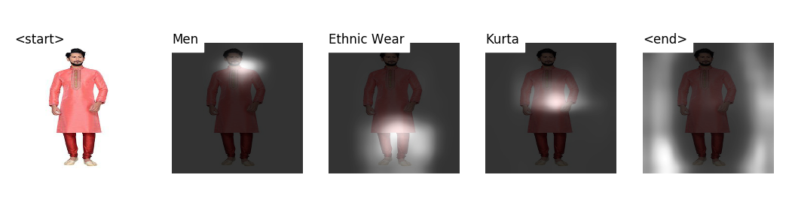

# Atlas

Source code of our paper "Constrained Beam Search Based Sequence model for product category classification" runnable on GPU and CPU. You can clone and run this project in your CPU/GPU to mimic the results reported in the paper.

## What does this project do?
* Performs automatic taxonomy prediction of Clothing images
* Provides a dataset of 183,996 clothing images from 52 categories along with image description and pre-defined taxonomy

:star: Star us on GitHub — it helps!

## Table of contents

- [Getting started](#getting-started)
    - [Setting up the project](#setting-up-the-project)
    - [Predicting using Product Categorization model](#predicting-using-product-categorization-model)
- [Concepts Overview](#concepts-overview)
- [Implementation](#implementation)
    - [Taxonomy Generation](#taxonomy-generation)
    - [Data Collection](#data-collection)
    - [Data Cleaning](#data-cleaning)
    - [Model Training and Prediction](#model-training-and-prediction)
- [FAQs](#faqs)
- [Authors](#authors)
- [Acknowledgements](#acknowledgements)
- [Reference](#reference)
- [License](#license)


## Getting started
### Setting up the project
* Clone this repository to your local machine

* Create a virtual environment named `atlas` and install all the project's dependencies
listed in [`models/product_categorization/requirements.txt`](https://github.com/vumaasha/Atlas/blob/master/models/product_categorization/requirements.txt)

`pip install -r models/product_categorization/requirements.txt`

### Predicting using Product Categorization model
Follow these steps to predict the category path for a product using pur pretrained product categoristion model: 
1. Download the pre-trained model and the word map file from [Google Drive](https://drive.google.com/drive/folders/1ZKNR2CytY89Q4kDYSwyQlA_pgUdocjeQ).
2. Switch to `models/product_categorization` directory
3. From the command line, point to the image, model, word map (and optionally, the beam size) as follows:

```
python caption_cbs.py --img='../../dataset/atlas_test/203_large.jpeg' --model='path/to/BEST_checkpoint_atlas_1_cap_per_img_1_min_word_freq.pth.tar' --word_map='path/to/WORDMAP_atlas_1_cap_per_img_1_min_word_freq.json' --karpathy_json='path/to/atlas_dataset.json' --beam_size=5
```



Our pre-trained model predicts the category path and displays an output image that shows which part of the image has been focussed by our model to predict the category level.

Similarly you can predict for other images using this command, by changing the path in `--img` parameter to point to your image location.

Few more sample predictions can be found in this [section](https://github.com/vumaasha/Atlas/tree/master/models/product_categorization#sample-predictions)


## Concepts Overview
We use attention based neural network Encoder-Decoder model to generate the sequences in the taxonomy. 

* **Encoder** - The Encoder is a **_101 layered Residual Network(ResNet)_** trained on the ImageNet classification that converts the input image into a fixed size vector.

* **Decoder** - The Decoder is a combination of **_Long Short-Term Memory(LSTM)_** along with Attention Network. This is the part of the model that predicts sequences for the taxonomy. It combines the output from the encoder and attention weights to predict category paths as sequences for the taxonomy. 

* **Attention** - Attention Network learns which part of the image has to be focused to predict the next level in the category path while performing the sequence classification task.

* **Constrained Beam Search** - Constrained Beam Search restricts the model from generating category paths that are not predefined in our taxonomy.  It limits the sequences chosen by the Decoder in order to generate category paths within the taxonomy.

## Implementation
### Taxonomy Generation
We gathered taxonomy for the clothing top level category from popular Indian e-commerce fashion sites. We analyzed popular products, niche, and premium clothing products across these stores and developed our taxonomy with 52 category paths. The list of 52 category paths and additional details can be found [here](https://github.com/vumaasha/Atlas/tree/master/dataset#11-taxonomy-generation)

### Data Collection
For all categories in taxonomy tree, we collected product data and its images from popular Indian E-commerce stores. Web scraping tools like Scrapy and Selenium were used to extract the product title, breadcrumb, image and price of each product.
Check out this [section](https://github.com/vumaasha/Atlas/tree/master/data_collection) to know more about our data collection strategy for **_Atlas_** dataset.

The dataset, **_Atlas_**, we used for training our model is a high-quality product taxonomy dataset focusing on clothing products. It contains **183,996 images** under 52 clothing categories.

We provide a JSON file `atlas_dataset.json` which has data and URL of the images for 183,996 products. A sample record from the JSON is shown below
```
{'filename': 'euro-fashion-men-s-cotton-brief-pack-of-3-c9f86351-product.jpeg', 
'title': "euro fashion\n men's cotton brief (pack of  3 )", 
'sentences': [{'tokens': ['Men', 'Inner Wear', 'Underwear']}], 
'image_url': 'https://images.voonik.com/01993582/euro-fashion-men-s-cotton-brief-pack-of-3-c9f86351-product.jpg?1522053196', 'split': 'train'}
```

Run `dataset/create_dataset.py` which crawls the images from all the `image_url` in JSON and creates our **_Atlas_** dataset
```
python dataset/create_dataset.py -m atlas 
```

### Data Cleaning
After collecting data, we found that many product listing also included a zoomed in images that display intrinsic details such as the texture of the fabric, brand labels, button, and pocket styles. These zoomed in images would drastically affect the quality of the dataset. We automated the process of filtering out the noisy images with the help of a simple 3 layer CNN based classification model

More details about the architecture of CNN Model and how we used it to clean our dataset can be found [here](https://github.com/vumaasha/Atlas/tree/master/models/zoomed_vs_normal#data-cleaning).

**Note:** Our Atlas dataset generated in the above section is already cleaned. No need to apply this Zoomed Vs Normal model on the dataset.

### Model Training and Prediction
We approach the product categorization problem as a sequence prediction problem by leveraging the dependency between each level in the category path. We use attention based neural network Encoder-Decoder architecture to generate sequences. 

Encoder is a 101 layered Residual Network(ResNet) trained on the ImageNet classification task which converts the input image to a fixed size vector. Decoder is a combination of Long Short-Term Memory(LSTM) along with attention network which combines the encoder output and attention weights to predict category paths as sequences. 

We also extend our model by introducing constrained beam search on top of it to restrict the model from generating category paths that are not predefined in our taxonomy. 

More details and procedures on model training can be found [here](https://github.com/vumaasha/Atlas/tree/master/models/product_categorization#product-categorization-model)

## FAQs


## Authors
* [Venkatesh Umaashankar](https://github.com/vumaasha)
* [Girish Shanmugam S](https://github.com/GirishShanmugam)
* [Aditi Prakash](https://github.com/aditiprakash)

See also the list of [contributors](https://github.com/vumaasha/Atlas/graphs/contributors) who participated in this project.

## Acknowledgements


## Reference
If you use this code as part of any published research, please acknowledge the following paper (it encourages researchers who publish their code!)

## License
This project is licensed under the MIT License - see the LICENSE.md file for details
