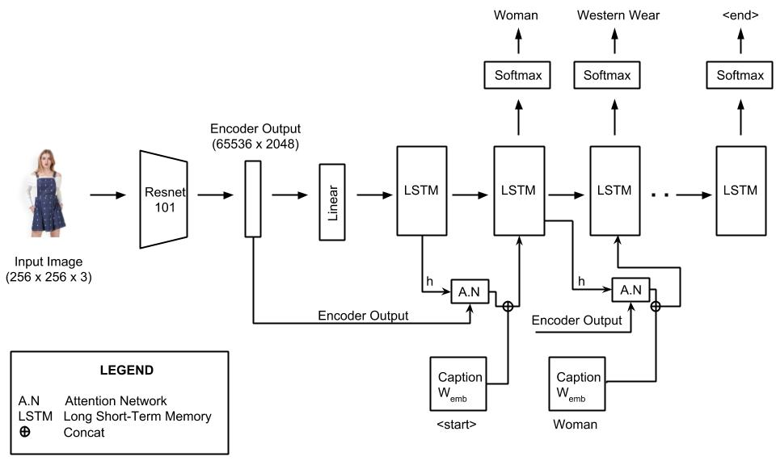
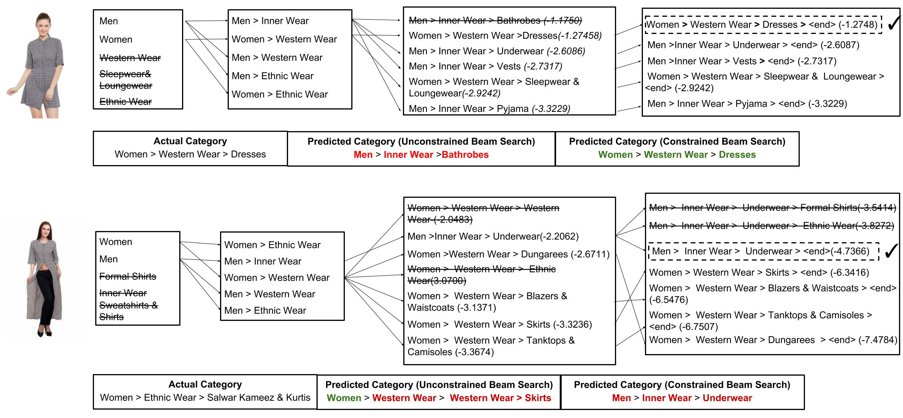

# Product Categorization Model

A constrained beam search and attention based sequence model for predicting the category path of a product using PyTorch.

This is the source code of the model explained in our paper "Constrained Beam Search Based Sequence model for product category classification" runnable on GPU and CPU. You can clone and run this project in your CPU/GPU to reproduce the results reported in the paper.

## Table of Contents
- [Quickstart](#quickstart)
- [Model Overview](#model-overview)
  - [Sequence Model - Encoder and Decoder](#sequence-model---encoder-and-decoder)
    - [Encoder](#encoder)
    - [Decoder](#decoder)
  - [Attention](#attention)
  - [Constrained Beam Search](#constrained-beam-search)
- [Sample Predictions](#sample-predictions)
- [Inferences](#inferences)
- [Acknowledgements](#acknowledgements)

## Quickstart
Follow the steps in this section to train the model and get predictions

### Step 1: Setting up
1. Clone this repository to your local machine

2. Create a virtual environment named `atlas` and install all the project's dependencies listed in `requirements.txt`

### Step 2: Preparing the dataset

We will be using our **_Atlas_** dataset to train our model. Make sure you have the dataset or refer this [section](https://github.com/vumaasha/Atlas/tree/master/dataset#atlas-dataset) to get the dataset.

Once you have our Atlas dataset, open `create_input_files.py` and provide the values for the following parameters:
- `karpathy_json_path` - path of the JSON file `atlas_dataset.json` which has the data along with the splits downloaded from the Google Drive 
- `image_folder` - path of the folder containing the images 
- `output_folder` - path of the folder where you want to store the outputs produced by this script

Run the script from the command line
```
python create_input_files.py
```

This creates the following files:
- An **HDF5 file** containing images for each split in an `I, 3, 256, 256` tensor, where `I` is the number of images in the split.
- A **JSON file** which contains the `word_map`, the word-to-index dictionary. 
- A **JSON file** for each split with a list of `N_c * I` encoded captions, where `N_c` is the number of captions sampled per image. In our case `N_c` is `1`. These captions are in the same order as the images in the HDF5 file. Therefore, the `ith` caption will correspond to the `ith` image.
- A **JSON file** for each split with a list of `N_c * I` caption lengths. In our case `N_c` is `1`. The `ith` value is the length of the `ith` caption, which corresponds to the `ith` image.

### Step 3: Training the Model

Open `train.py` and provide the values for the data parameters
- `data_folder` - The `output_folder` path mentioned in the above step.
- `data_name`  - The base name shared by the files in output folder. For example `atlas_1_cap_per_img_5_min_word_freq`

**_Note:_** Do not modify the model and training parameters if you try to replicate our results. Instead if you would like to explore or play around with the model you can modify these parameters.

To train the model, run this file
```
python train.py
```
This trains the model and saves it as a tar file.

To resume training at a checkpoint, point to the corresponding file with the checkpoint parameter at the beginning of the code.


### Step 4: Getting Predictions and Metrics of the model

Open `generate_metrics.py` and specify the values for the parameters for `get_predictions()` and `get_metrics_from_predictions()` at the end of the file.

-`karpathy_json_path` - path of the JSON file `atlas_dataset.json` which has the data along with the splits
-`model_path` - path where the model is stored
-`word_map_path` - path of the word_map JSON file
-`predictions_file_path` - output CSV file path where you want your predictions to be saved.

Run this script,
```
python generate_metrics.py 
```

This script reads each image in the karpathy JSON, predicts its category path and stores it as a CSV file.
The records in the output CSV file looks like this:

|actual_category | file_name | predicted_category | split_value |
| --- | --- | --- | --- |
| "['Women', 'Western Wear', 'Tops&Tees']" | coresdataset19/Women_Western Wear_Tops&Tees/images/4a69fc38a31f5e168558f02967b70ff14dba580a.jpg | "['Women', 'Western Wear', 'Tops&Tees']" | train |
| "['Men', 'Western Wear', 'Trousers']" | coresdataset19/Men_Western Wear_Trousers/images/739299c941d67567d8bafbc68070a79f204ed599.jpg | "['Men', 'Western Wear', 'Trousers']" | train |


It also prints the classification report for train, validation and test splits in the console. 

### Step 5: Predict category path and Visualise Attention
Run `caption_cbs.py` to predict the category and visualize the attention. 

Command to run: 
`python caption.py -m <path_to_wordmap_file> -wm <path_to_model> -i <path_to_image>`

Example:
```
python caption_cbs.py --img='../../dataset/atlas_test/sample_1.jpg' --model='path/to/BEST_checkpoint_atlas_1_cap_per_img_5_min_word_freq.pth.tar' --word_map='path/to/WORDMAP_atlas_1_cap_per_img_5_min_word_freq.json' --beam_size=5

```
This script predicts the category path and displays an output image that shows which part of the image has been focussed by our model to predict the category level.


---
## Model Overview
We approach the product categorization problem as a **_sequence prediction problem_** by leveraging the dependency between each level in the category path. We use attention based neural network Encoder-Decoder architecture to generate sequences. 

- **Encoder** is a **_101 layered Residual Network(ResNet) trained on the ImageNet classification task_** which converts the input image to a fixed size vector. 
- **Decoder** is a **_combination of Long Short-Term Memory(LSTM) along with attention network_** which combines the encoder output and attention weights to predict category paths as sequences. 
- We also extend our model by introducing **_constrained beam search_** on top of it to restrict the model from generating category paths that are not predefined in our taxonomy. 

## Sequence Model - Encoder and Decoder
### Encoder
In Encoder, we use `Convolutional Neural Network(CNN)` to produce fixed size vectors. The input images are represented by the 3 color channels of RGB values. As we use the encoder only to encode images and not for classifying them, we remove the last two layers (linear and pooling layers) from the `ResNet-101 model`. The final encoding produced by the encoder will have the dimensions: `batch size x 14 x 14 x 2048`.

### Decoder
The decoder receives the encoded image from the encoder using which it initializes the hidden and cell state of the LSTM model through two linear layers. Two virtual category levels `<start>`  and `<end>` which denote the beginning and end of the sequence are added  to the category path. The decoder LSTM uses `teacher forcing` for training.

The decoder uses a `<start>`  marker which is considered to be the `zeroth category level`. The `<start>`  marker along with the encoded image is used to generate the first-top level of the category path. Subsequently, all other levels are predicted using the sequence generated so far along with the attention weights.

An `<end>` marker is used to mark the end of a category path. The decoder stops decoding the sequence further as soon it generates the `<end>` marker

At each time step, the decoder computes the weights and attention weighted encoding from the attention network using its previous hidden state. A final `softmax` layer transforms the hidden state into scores is stored so that it can be used later in beam search for selecting `k` best levels.

The encoder-decoder architecture of our model is shown below:


## Attention
The attention network learns `which part of the image has to be focused` to predict the next level in the category path while performing the sequence classification task. The attention network generates weights by considering the relevance between the encoded image and the previous hidden state or previous output of the decoder

It consists of linear layers which transform the encoded image and the previous decoder's output to the same size. These vectors are summed together and passed to another linear layer which calculates the values to be softmaxed and then to a ReLU layer. A final softmax layer calculates the weights `alphas` of the pixels which add up to 1.

Architectiure of our attention network is shown below


## Constrained Beam Search
Constrained Beam Search(CBS) is an approximate search algorithm and an extension of the Beam Search. It enforces constraints over resulting output sequences that can be expressed in a finite-state machine. In our work, we use CBS to restrict the decoder to generate category paths within our taxonomy. A category path is deemed valid if it is present in our pre-defined taxonomy.

We created word mappings from the taxonomy tree which has the next possible categories for every category path. At each step, CBS uses this word map to check whether the current category is present in the next possible categories list of the category path. If the category is not present then they do not form a valid category path hence this sequence will be not be considered while choosing top k category paths. We set the beam size 'k' to 5, therefore CBS selects top 5 valid category paths based on the additive scores of the sequences at every decode step

## Sample Predictions
Two samples are shown below to understand how CBS helps in constructing valid category paths.

### Case 1:
The categories `Western Wear`, `Sleepwear&Loungewear` and `Ethnic Wear` are eliminated, as the next categories after <start> are Men and Women which can be seen in taxonomy tree [here](https://github.com/vumaasha/Atlas/tree/master/dataset#about-the-taxonomy). In the third step, though the category path `Men > Inner Wear > Bathrobes` has the highest additive score of `-1.1750`, it was restricted by CBS as `Bathrobes` does not come after `Men > Inner Wear`. Once all the sequences are terminated, the category path with the highest score is returned. In this case, all category paths are terminated at the fourth step and `Women > Western Wear > Dresses` which has the highest overall score of `-1.2748` is returned. 
 
For the same image, unconstrained beam search predicted an invalid category path whereas CBS predicted a valid as well as correct category path

### Case 2:
Unconstrained beam search returned a category path with 4 levels - `Women > Western Wear >  Western Wear > Skirts` whereas the category path generated by CBS was `Men > Inner Wear > Underwear`. Despite eliminating the output sequences with increased levels, the category path from CBS was valid but wrong.

## Inferences

1. With our model, we achieved an `f-score` of **0.90** on our training split, **0.88** on validation and test splits on **_Atlas_** dataset
2. We show that Constrained Beam Search(CBS) improved the accuracy of our model and outperformed unconstrained beam search in classification tasks
3. Constrained Beam Search(CBS) guaranteed the prediction of valid category paths, however, it did not produce accurate predictions all the time

## Acknowledgements

1. The source code of our model was forked from this repository: https://github.com/sgrvinod/a-PyTorch-Tutorial-to-Image-Captioning
