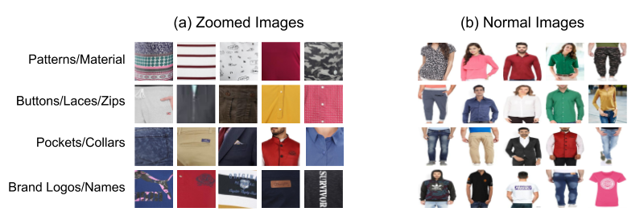
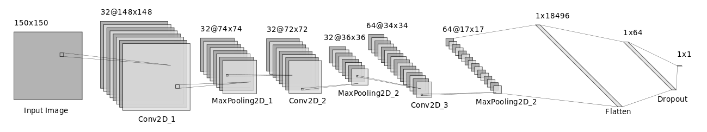

# Data Cleaning

## Objective
- Build an Image classification model using CNN and keras to predict whether an image is a zoomed or a normal image.
- Given a dataset with images 
    - Run this model and classify the images as zoomed or normal 
    - Create two folders(zoomed and normal) and place the images in the corresponding folder based on their predictions. 

## Why do we need this?
In an E-commerce store not all the images shown for a product are necessarily a good representative image of the product. In case of clothing, we found that many product listing also included a zoomed in images that display intrinsic details such as the texture of the fabric, brand labels, button, and pocket styles. An automatic classification model is need for the following reasons:

- To find and remove these noisy images manually would take considerable time and effort. 
- Including these zoomed in images would drastically affect the quality of the dataset. 

Few examples of (a) Zoomed and (b) Normal images from our **_Atlas_** dataset are shown below. 
(*The Zoomed images show close-ups of the apparel or cropped versions of the image that make it difficult to recognize the product, whereas the Normal images show figures with the entire product visible*)

## How is it done?

We prepared the training data by visual inspection. We segregated noisy and high-quality images into two different folders by looking at the thumbnails of the hundreds of product images in a go.

We automated the process of filtering out the noisy images with the help of a simple 3 layer CNN based classification model. 
The notebook [here](https://github.com/vumaasha/Atlas/tree/master/models/zoomed_vs_normal/Zoomed_vs_Normal.ipynb) explains the steps to be followed to build, train and predict using our model.

- Our CNN model was trained on 6005 normal images and 1054 zoomed images and achieved an f-score of **0.98** on test set. 
- We applied this model on our **_Atlas_** dataset to filter out the noisy images which has **183,996 images** after cleaning.

You can download our pre-trained model `zoomed_vs_normal.h5` by filling out [this form](https://goo.gl/forms/C1824kjmbuVo7H6H3).

## Model Architecture

